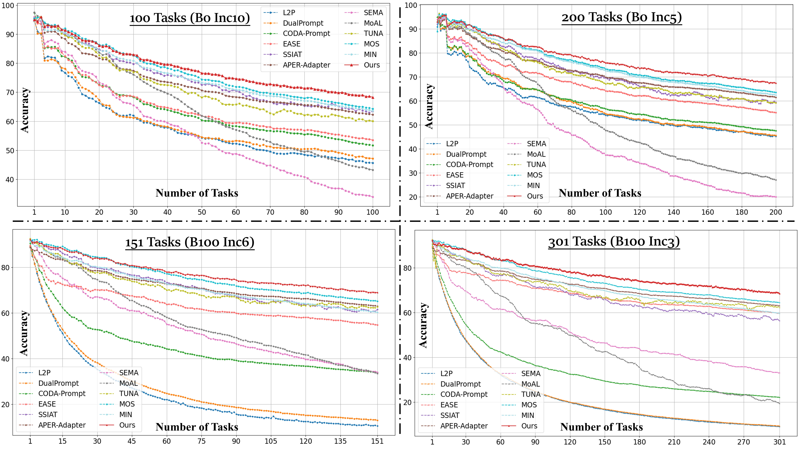
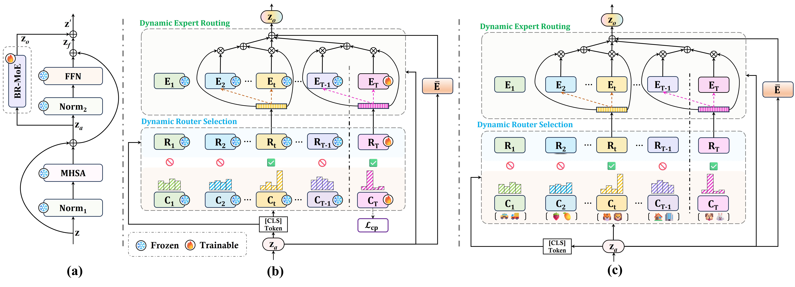

# [[ICML 2026] Scaling Continual Learning to 300+ Tasks with Bi-Level Routing Mixture-of-Experts](https://arxiv.org/abs/2602.03473)

This is an official PyTorch implementation of "[**Scaling Continual Learning to 300+ Tasks with Bi-Level Routing Mixture-of-Experts**](https://arxiv.org/abs/2602.03473)".

## Overview
**TL;DR: A strong continual learner capable of scaling to over 300 tasks.**

Continual learning, especially class-incremental learning (CIL), on the basis of a pre-trained model (PTM) has garnered substantial research interest in recent years. However, how to effectively learn both discriminative and comprehensive feature representations while maintaining stability and plasticity over very long task sequences remains an open problem. We propose **CaRE**, a scalable **C**ontinual Le**a**rner with efficient Bi-Level **R**outing Mixture-of-**E**xperts (BR-MoE). The core idea of BR-MoE is a bi-level routing mechanism: a router selection stage that dynamically activates relevant task-specific routers, followed by an expert routing phase that dynamically activates and aggregates experts, aiming to inject discriminative and comprehensive representations into every intermediate network layer. On the other hand, we introduce a challenging evaluation protocol for comprehensively assessing CIL methods across very long task sequences spanning hundreds of tasks. Extensive experiments show that CaRE demonstrates leading performance across a variety of datasets and task settings, including commonly used CIL datasets with classical CIL settings (e.g., 5-20 tasks). To the best of our knowledge, CaRE is the first continual learner that scales to **very long task sequences (ranging from 100 to over 300 non-overlapping tasks)**, while outperforming all baselines by a large margin on such task sequences.

<center> 



Incremental performance comparisons between our CaRE and other representative PTM-based CIL methods.
</center>

<center> 



The workflow of the proposed BR-MoE.
</center>


## Experiments

### 1. Dataset Preparation

#### Long-Task-Sequence CIL Benchmark

Our long-task-sequence CIL benchmark, **OmniBenchmark-1K**, can be downloaded from the following sources:

- Hugging Face: [Download](https://huggingface.co/datasets/LMMM2025/OmniBenchmark-1K/tree/main)
- OneDrive: [Download](https://connecthkuhk-my.sharepoint.com/:f:/g/personal/loumeng_connect_hku_hk/IgCFe2483nu_TqpDMQpWVukEAcv7hiLGzAfShhpPPr0WBSk?e=kwr1Cg)
- Baidu Netdisk: [Download](https://pan.baidu.com/s/16SGTb1w2xUndRhDe2TMRgg?pwd=fwk5)


#### Standard CIL Benchmarks

The remaining benchmark datasets used in this paper can be obtained from the processed [dataset links](https://github.com/LAMDA-CL/LAMDA-PILOT/tree/main#-datasets) released by [LAMDA-PILOT](https://github.com/LAMDA-CL/LAMDA-PILOT/tree/main#-datasets).

**NOTE**: Please place all processed datasets under the `dataset/` directory. If you prefer a different storage location, you can modify `data_root` in [utils/data.py](utils/data.py) to customize your dataset save directory.

### 2. Requirements

We highly suggest using our provided dependencies to ensure reproducibility:

```bash
# Environments:
cuda==12.1
python==3.12.4
# Packages:
pip install torch==2.2.2 torchvision==0.17.2 --index-url https://download.pytorch.org/whl/cu121
pip install timm==0.6.13
```

### 3. Training

#### Very Long Task Sequences on OmniBenchmark-1K (100-301 Tasks)

```bash
bash scripts/omnibenchmark1k/run_ob1k_100task_b0inc10.sh   # 100 tasks
bash scripts/omnibenchmark1k/run_ob1k_151task_b100inc6.sh  # 151 tasks
bash scripts/omnibenchmark1k/run_ob1k_200task_b0inc5.sh    # 200 tasks
bash scripts/omnibenchmark1k/run_ob1k_301task_b100inc3.sh  # 301 tasks
```

#### Short Task Sequences (5-20 Tasks)

```bash
# Here is an example of experiments on ImageNet-R dataset
bash scripts/imagenet-r/run_inr_10task_b0inc20.sh  # 10 tasks
bash scripts/imagenet-r/run_inr_20task_b0inc10.sh  # 20 tasks
```

All remaining experimental settings are provided in [scripts](scripts/).

## Citations

- If you find this project useful for your research, please cite:

```bibtex
@inproceedings{lou2026care,
  title={Scaling Continual Learning to 300+ Tasks with Bi-Level Routing Mixture-of-Experts},
  author={Lou, Meng and Fu, Yunxiang and Yu, Yizhou},
  booktitle={International Conference on Machine Learning},
  year={2026},
}
```

- If you use the OmniBenchmark-1K dataset, please ensure you cite both our paper and the original OmniBenchmark paper as follows:

```bibtex
@inproceedings{zhang2022omnibench,
  title={Benchmarking Omni-Vision Representation through the Lens of Visual Realms},
  author={Zhang, Yuanhan and Yin, Zhenfei and Shao, Jing and Liu, Ziwei},
  booktitle={European Conference on Computer Vision},
  year={2022},
}
```

## Acknowledgments

- We would like to thank the following repositories for providing valuable components and resources that supported this project:
> [LAMDA-PILOT](https://github.com/LAMDA-CL/LAMDA-PILOT/tree/main)     
> [APER](https://github.com/LAMDA-CL/RevisitingCIL)

- We would also like to extend our sincere thanks to [Dr. Yuanhan Zhang](https://zhangyuanhan-ai.github.io/) for granting permission to create and share this derivative dataset of OmniBenchmark.


## Contact
If you have any questions, please feel free to create an issue or contact me at ``lmzmm.0921@gmail.com``.
